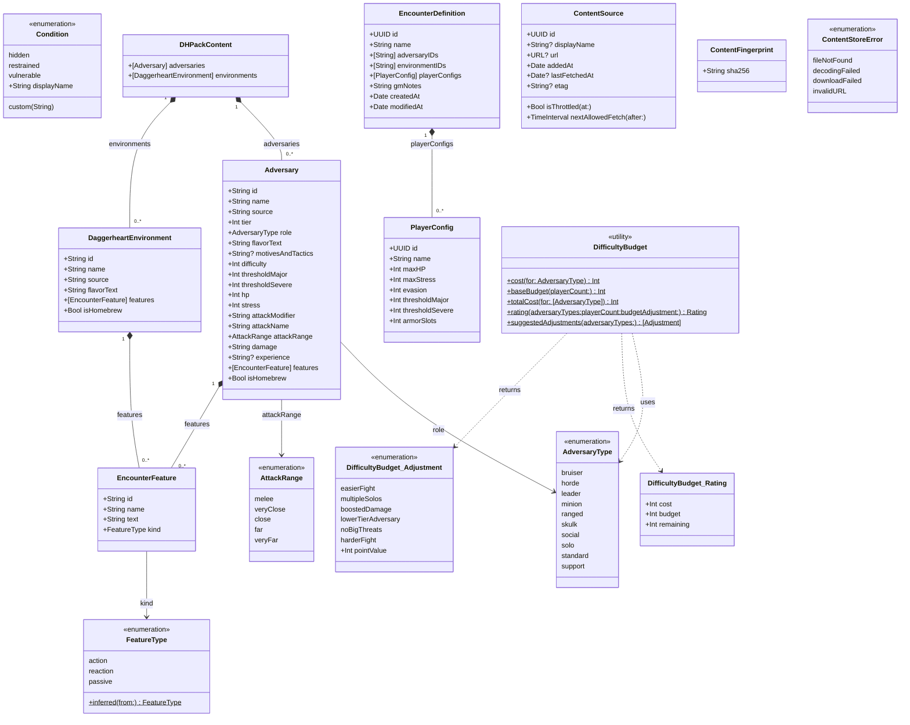

# DHModels — Type Relationship Diagram

`DHModels` is the catalog layer. All types are value types
(`struct` or `enum`), `Codable`, `Sendable`, and Linux-safe.

## Key relationships

| Relationship | Description |
|---|---|
| `EncounterDefinition` stores IDs | Holds `adversaryIDs` and `environmentIDs` as `[String]` slugs — resolved into live slots at session creation via `Compendium` (DHKit) |
| `PlayerConfig` → `PlayerSlot` | `PlayerConfig` is the serialisable prep-time form; `PlayerSlot` (DHKit) is the live runtime form created from it |
| `DifficultyBudget` | Stateless utility — call its static methods with a list of `AdversaryType` to estimate encounter difficulty |
| `DHPackContent` | Decoded form of a `.dhpack` file; fed into `Compendium.replaceSourceContent(sourceID:adversaries:environments:)` |
